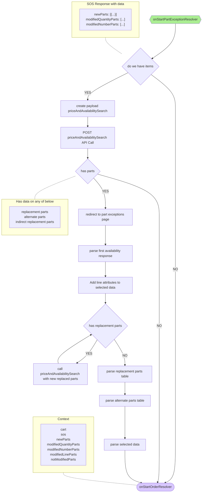

# react.dev

This repo contains the source code and documentation powering [react.dev](https://react.dev/).

## Getting started

### Prerequisites

1. Git
1. Node: any 12.x version starting with v12.0.0 or greater
1. Yarn: See [Yarn website for installation instructions](https://yarnpkg.com/lang/en/docs/install/)
1. A fork of the repo (for any contributions)
1. A clone of the [react.dev repo](https://github.com/reactjs/react.dev) on your local machine

### Installation

1. `cd react.dev` to go into the project root
3. `yarn` to install the website's npm dependencies

### Running locally

1. `yarn dev` to start the development server (powered by [Next.js](https://nextjs.org/))
1. `open http://localhost:3000` to open the site in your favorite browser

## Contributing

### Guidelines

The documentation is divided into several sections with a different tone and purpose. If you plan to write more than a few sentences, you might find it helpful to get familiar with the [contributing guidelines](https://github.com/reactjs/react.dev/blob/main/CONTRIBUTING.md#guidelines-for-text) for the appropriate sections.

### Create a branch

1. `git checkout main` from any folder in your local `react.dev` repository
1. `git pull origin main` to ensure you have the latest main code
1. `git checkout -b the-name-of-my-branch` (replacing `the-name-of-my-branch` with a suitable name) to create a branch

### Make the change

1. Follow the ["Running locally"](#running-locally) instructions
1. Save the files and check in the browser
  1. Changes to React components in `src` will hot-reload
  1. Changes to markdown files in `content` will hot-reload
  1. If working with plugins, you may need to remove the `.cache` directory and restart the server

### Test the change

1. If possible, test any visual changes in all latest versions of common browsers, on both desktop and mobile.
2. Run `yarn check-all`. (This will run Prettier, ESLint and validate types.)

### Push it

1. `git add -A && git commit -m "My message"` (replacing `My message` with a commit message, such as `Fix header logo on Android`) to stage and commit your changes
1. `git push my-fork-name the-name-of-my-branch`
1. Go to the [react.dev repo](https://github.com/reactjs/react.dev) and you should see recently pushed branches.
1. Follow GitHub's instructions.
1. If possible, include screenshots of visual changes. A preview build is triggered after your changes are pushed to GitHub.

## Translation

If you are interested in translating `react.dev`, please see the current translation efforts [here](https://github.com/reactjs/react.dev/issues/4135).

## License
Content submitted to [react.dev](https://react.dev/) is CC-BY-4.0 licensed, as found in the [LICENSE-DOCS.md](https://github.com/reactjs/react.dev/blob/main/LICENSE-DOCS.md) file.

## Mermaid diagrams

